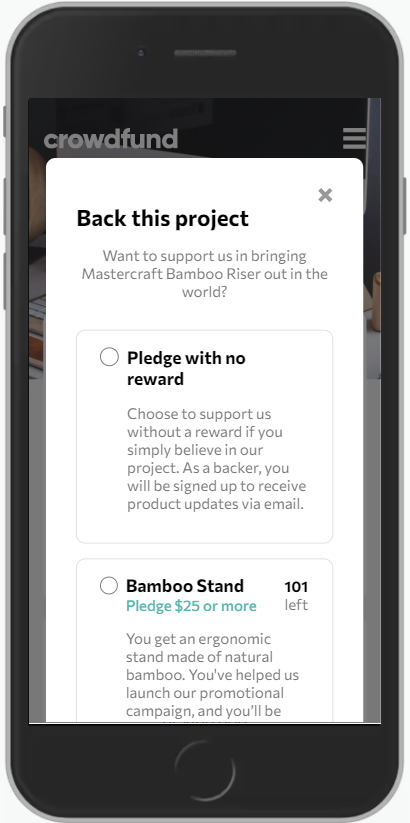

# Frontend Mentor - Crowdfunding product page solution

This is a solution to the [Crowdfunding product page challenge on Frontend Mentor](https://www.frontendmentor.io/challenges/crowdfunding-product-page-7uvcZe7ZR). Frontend Mentor challenges help you improve your coding skills by building realistic projects. 

## Table of contents

- [Overview](#overview)
  - [The challenge](#the-challenge)
  - [Screenshot](#screenshot)
  - [Links](#links)
  - [Built with](#built-with)
  - [What I learned](#what-i-learned)
  - [Continued development](#continued-development)
  - [Useful resources](#useful-resources)
- [Author](#author)
- [Acknowledgments](#acknowledgments)

## Overview

### The challenge

Users should be able to:

- View the optimal layout depending on their device's screen size
- See hover states for interactive elements
- Make a selection of which pledge to make
- See an updated progress bar and total money raised based on their pledge total after confirming a pledge
- See the number of total backers increment by one after confirming a pledge
- Toggle whether or not the product is bookmarked

### Screenshot

### Links

- Solution URL: [https://www.frontendmentor.io/solutions/reactcrowdfundingproductchallenge-W8KQ8OCuR](https://www.frontendmentor.io/solutions/reactcrowdfundingproductchallenge-W8KQ8OCuR)
- Live Site URL: [https://react-crowdfunding-product-challenge.vercel.app/](https://react-crowdfunding-product-challenge.vercel.app/)

### Built with

- Semantic HTML5 markup
- CSS custom properties
- Flexbox
- [React](https://reactjs.org/) - JS library
- [Styled Components](https://styled-components.com/)

### What I learned

Probably the hardest Frontend Mentor challenge yet! 

When I started this challenge, my main goal was to get to practice with styled components, but I immediately realised the project was actually pretty complex. 

It took me hours of work and a lot of struggle, but I am really happy with the final result. And of course, I feel much more confident with styled components!

### Continued development

In my next project, I would like to start exploring more complex ways to handle state: so far, I have always only sticked to the useState hook.

### Useful resources

- [StackOverflow - hide-scroll-bar-but-while-still-being-able-to-scroll](https://stackoverflow.com/questions/16670931/hide-scroll-bar-but-while-still-being-able-to-scroll) - This article spared me a fair share of struggle when I was trying to hide the scrollbar in the popup.

## Author

- Frontend Mentor - [@alessioitalo](https://www.frontendmentor.io/profile/alessioitalo)
- Twitter - [@alessioitalo](https://www.twitter.com/alessioitalo)
